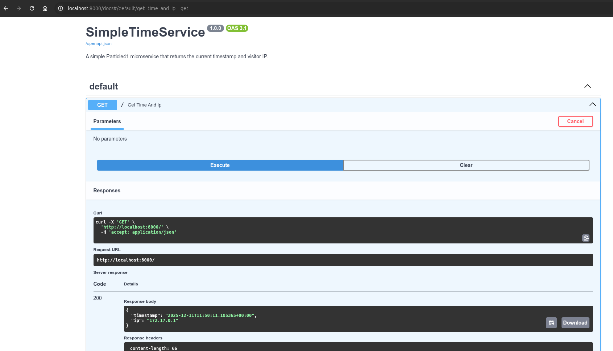
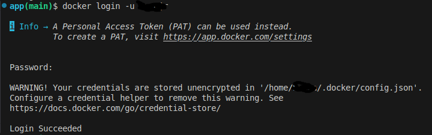
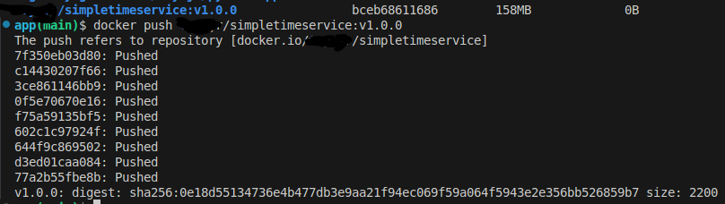

# SimpleTimeService

This is a simple microservice that returns a pure JSON response when its / URL path is accessed:

```JSON
{
  "timestamp": "<current date and time>",
  "ip": "<the IP address of the visitor>"
}
```

## Application Dependencies

The application is developed using `Python 3.12.3`. All the requirements for this application can be found in the [requirements.txt](./app/requirements.txt) file, and they can be installed using pip.

### Testing Locally WITHOUT Docker

To test lcoally without docker, you need to first clone the repository and then install all the dependencies using:

```SHELL
cd app/
pip install -r requirements.txt
```

Next, you need to ensure that the following lines in [main.py](./app/main.py) is uncommented

```PYTHON
import uvicorn # line 7
##################
#rest of the code#
##################
if __name__ == "__main__": # line 40. move it out of the docstring
    uvicorn.run(app, host="0.0.0.0", port=8000) # line 41. move it out of the docstring
```

Now, you open a new terminal and start the application:

```SHELL
$ python3 main.py
INFO:     Started server process [1]
INFO:     Waiting for application startup.
INFO:     Application startup complete.
INFO:     Uvicorn running on http://0.0.0.0:8000 (Press CTRL+C to quit)
```

Then you should be able to access it from [http://localhost:8000/](http://localhost:8000/)


You can also access the documentation page as well by adding the `/docs` path:


### Testing Locally WITH Docker

If you don't have docker engine installed, you can quickly do that from their [official documentation](https://docs.docker.com/engine/install). Once you have that installed, in the `app/` directory, there's a [Dockerfile](./app/Dockerfile) you can use to build and run a docker image using the following commands.

```SHELL
docker build -t simpletimeservice:$(git describe --tags --abbrev=0) .
# you can replace the $(git describe --tags --abbrev=0) with any label you want. this is here to ensure that the image gets built with the lastest tag in the repository

# start up the image in a container and map the host port to the application port
docker run -d --name test -p 8000:8000 simpletimeservice:v1.0.0

# check for the running container
docker ps
```


You can also access the application on localhost, because of the port mapping. Notice the IP is same as that of the docker container.


Finally, create a [dockerhub account](https://hub.docker.com/) if you don't have one, and push your built image there (this will come in handy for running anywhere by anyone).

```SHELL
docker login -u <username>
```



```SHELL
docker tag simpletimeservice:v1.0.0 <dockerhub_username>/simpletimeservice:v1.0.0
docker push <dockerhub_username>/simpletimeservice:v1.0.0
```


