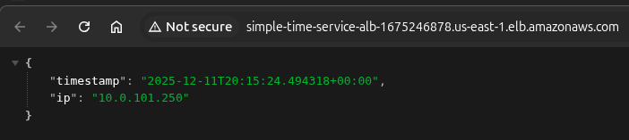

# Provisioning the Infrastructure

Here, we make use of [terraform](https://developer.hashicorp.com/terraform/tutorials/aws-get-started/install-cli), version >= 1.5.0, to provision the Amazon ECS infrastructure that our [containerized application](../app/) would run smoothly on.

You'd also need to AWS configuration using the [aws-cli](https://docs.aws.amazon.com/cli/latest/userguide/getting-started-install.html) utility. You can [learn more here](https://docs.aws.amazon.com/cli/v1/userguide/cli-configure-files.html#cli-configure-files-format) how to configure your long/short term credentials.

## Setting Up the State Lock Bucket

As opposed to using the [new native S3 state locking method](https://developer.hashicorp.com/terraform/language/backend/s3#use_lockfile), we would be creating a bucket and locking the `.tfstate` with DynamoDB.

In the [backend](./backend/) folder, we have all the files we would be using to provision the bucket and dynamodb as well. The state file for this would be managed locally, so take note of the output variables for the `bucket_name` and `dynamodb_table_name`.

You need to keep the state file for this part locally, you'd also use the [terraform.tfvars.examples](./backend/terraform.tfvars.example) file to create your variables. Then you can now plan, **review** and apply.

```SHELL
terraform plan
terraform apply
```

## Setting Up the ECS Infrastructure

All terraform configuration files for setting up the AWS ECS infrastructure are in the [./aws/](./aws/) folder. You need to create your own `terraform.tfvars` using the [terraform.tfvars.examples](./aws/terraform.tfvars.example) file as a template.

Also, after setting up the backend, you need to update the following of your [provider.tf](./aws/provider.tf) file:

```TERRAFORM
terraform {
  # remaining config

  backend "s3" {
    bucket = <update>
    key = <update>
    region = <update>
    dynamodb_table = <update>
  }

  # remaining config
}
```

Next you plan, review, and apply your configuration:

```SHELL
terraform plan
terraform apply
```

| LOADBALANCER TARGET I | LOADBALANCER TARGET II |
|:---------------------:|:----------------------:|
|  |  |
