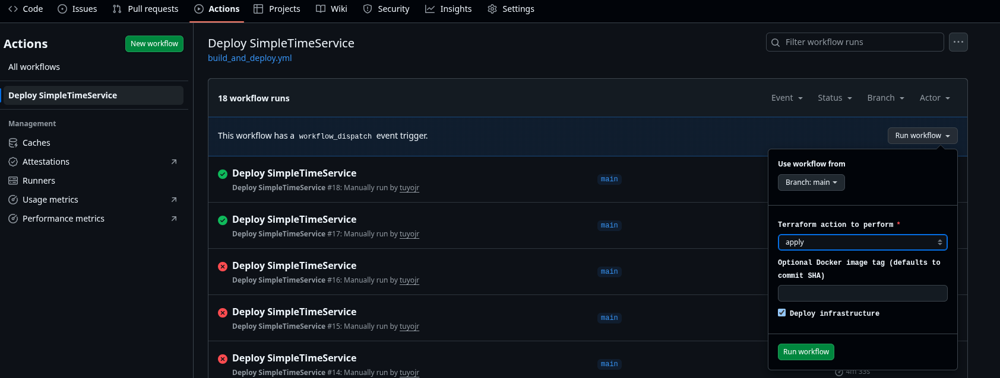

# Provisioning the Infrastructure

Here, we make use of [terraform](https://developer.hashicorp.com/terraform/tutorials/aws-get-started/install-cli), version >= 1.5.0, to provision the Amazon ECS infrastructure that our [containerized application](../app/) would run smoothly on.

You'd also need to AWS configuration using the [aws-cli](https://docs.aws.amazon.com/cli/latest/userguide/getting-started-install.html) utility. You can [learn more here](https://docs.aws.amazon.com/cli/v1/userguide/cli-configure-files.html#cli-configure-files-format) how to configure your long/short term credentials.

## Setting Up the State Lock Bucket

As opposed to using the [new native S3 state locking method](https://developer.hashicorp.com/terraform/language/backend/s3#use_lockfile), we would be creating a bucket and locking the `.tfstate` with DynamoDB.

In the [backend](./backend/) folder, we have all the files we would be using to provision the bucket and dynamodb as well. The state file for this would be managed locally, so take note of the output variables for the `bucket_name` and `dynamodb_table_name`.

You need to keep the state file for this part locally, you'd also use the [terraform.tfvars.examples](./backend/terraform.tfvars.example) file to create your variables. Then you can now plan, **review** and apply.

```SHELL
terraform plan
terraform apply
```

> NOTE: The two options below require that you have either used the configuration files in [backend/](./backend/) folder or manually provisioned the s3 backend and dynamodb table and stored their names safely.

## Setting Up the ECS Infrastructure

All terraform configuration files for setting up the AWS ECS infrastructure are in the [./aws/](./aws/) folder. You need to create your own `terraform.tfvars` using the [terraform.tfvars.examples](./aws/terraform.tfvars.example) file as a template.

Also, after setting up the backend, you need to update the following of your [provider.tf](./aws/provider.tf) file:

```TERRAFORM
terraform {
  # remaining config

  backend "s3" {
    bucket = <update>
    key = <update>
    region = <update>
    dynamodb_table = <update>
  }

  # remaining config
}
```

Next you plan, review, and apply your configuration:

```SHELL
terraform plan
terraform apply
```

| LOADBALANCER TARGET I | LOADBALANCER TARGET II |
|:---------------------:|:----------------------:|
|  |  |

## Setting Up the Infrastructure with GitHub Actions

For this step, you need the following repository secret variables setup: `Settings > Secrets and variables > Actions`:

| VARIABLE |
|:--------:|
| AWS_ACCESS_KEY_ID |
| AWS_REGION |
| AWS_SECRET_ACCESS_KEY |
| DOCKERHUB_TOKEN |
| DOCKERHUB_USERNAME |
| ORG |
| TF_VAR_BUCKET_NAME |
| TF_VAR_LOCK_TABLE_NAME |
| TF_VAR_PROJECT_NAME |
| TF_VAR_VPC_CIDR |

- The AWS secrets are for terraform to be able to connect to your AWS account. You can generate temporary credentials as well.
- You'd also need to generate a temporary Personal Access Token for your Docker Hub account, so you can push images. Follow this guide from [Docker documentation](https://docs.docker.com/security/access-tokens/#create-a-personal-access-token).

For this step, the [aws/provider.tf](./aws/provider.tf) has place holders that are updated int the GitHub workflow.

```TERRAFORM
terraform {
  # remaining config

  backend "s3" {
    bucket         = "BACKEND_BUCKET_NAME"
    key            = "terraform/state"
    region         = "BACKEND_REGION"
    dynamodb_table = "BACKEND_DYNAMODB_TABLE"
  }

  # remaining config
}
```

The workflow has the following capabilities

- You have the option to manually trigger it.
- You have the option to apply new resources or destroy the resources provisioned.
- You can also specify a specific image tag you want for your Docker image. Currently, the last commit hash is what is tagged.



Finally, when the resources are provisioned, you'd need to go the created loadbalancer created on AWS to get the ALB DNS, because the workflow would not show some values marked as sensitive in the terraform output. For example:

```TEXT
Outputs:

alb_dns_name = "***-alb-1246565461.***.elb.amazonaws.com"
alb_url = "http://***-alb-1246565461.***.elb.amazonaws.com"
cloudwatch_log_group = "/ecs/***"
ecs_cluster_name = "***-cluster"
ecs_service_name = "***-service"
...
```

Your SimpleTimeService application should be availble over http://loadbalancer_dns/
